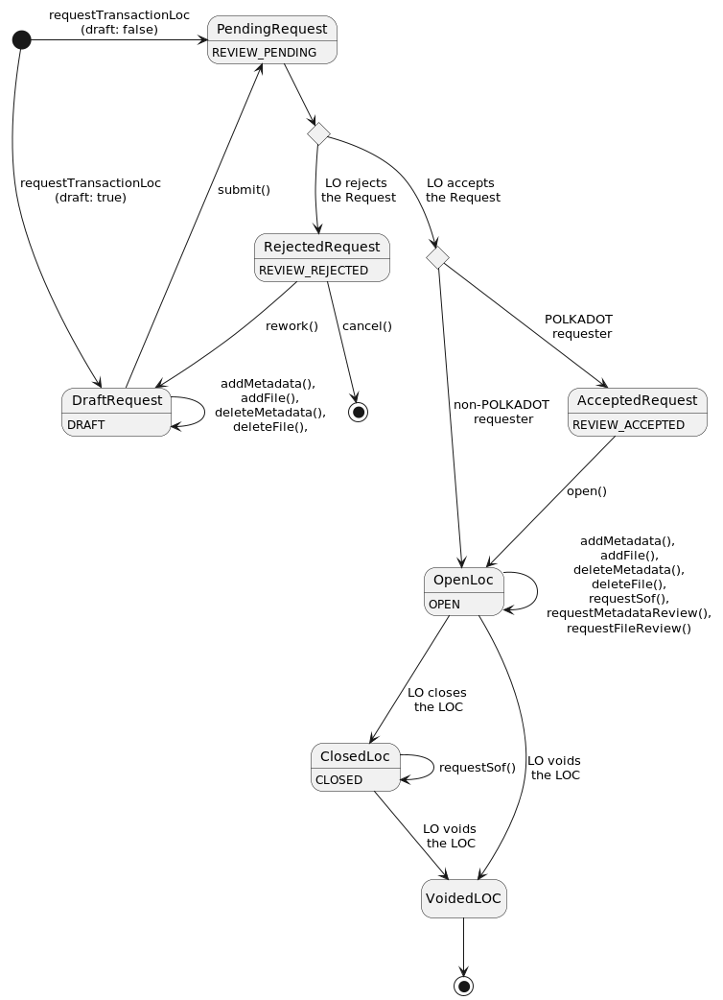
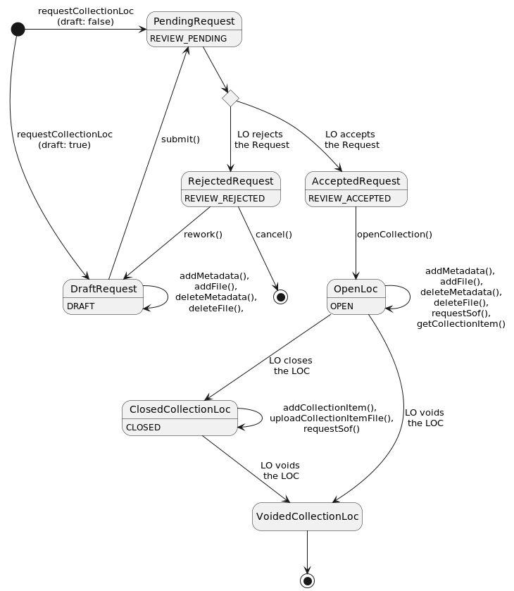
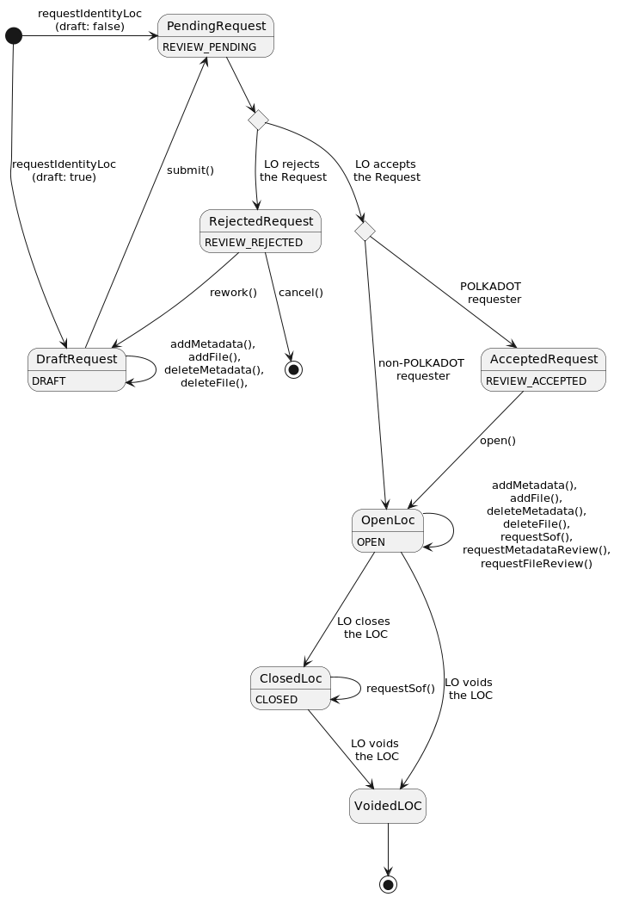

# Legal Officer Case (LOC)

## State

:::note
An [authenticated client](authentication.md) is necessary for all LOC operations.
:::
The global state of LOCs can be obtained (and later on, refreshed) with:

```typescript
const locsState = await client.locsState();
const refreshedState = await locsState.refresh();
```

:::caution
All user operations (`requestTransactionLoc`, `requestCollectionLoc`, etc.), as well as `refresh`, do return a new state.
Always use the most recent state, and discard the former state.
In the example above, the var `locsState` must not be used any more as soon as `refreshedState` is available.
:::

## Transaction LOC

### Lifecycle



### Request

```typescript
const pendingRequest = await locsState.requestTransactionLoc({
    legalOfficer: alice,
    description: "This is a Transaction LOC",
    userIdentity: {
        email: "john.doe@invalid.domain",
        firstName: "John",
        lastName: "Doe",
        phoneNumber: "+1234",
    },
});
```

:::note
The user identity must not be added when the requesting account is protected by the legal officer
:::

Then you have to wait for the LO to open the LOC:

```typescript
const openLoc = await pendingRequest.refresh() as OpenLoc;
```

### Metadata

Metadata can be added to, or removed from, an open LOC:

```typescript title="addMetadata"
openLoc = await openLoc.addMetadata({
    name: "Some name",
    value: "Some value"
});
```

```typescript title="deleteMetadata"
openLoc = await openLoc.deleteMetadata({
    name: "Some name"
});
```

## Collection LOC

### Lifecycle



### Request

A Collection LOC can be requested to a given Legal Officer by providing a description.

```typescript
const pendingRequest = await locsState.requestCollectionLoc({
    legalOfficer: alice,
    description: "This is a Collection LOC",
    userIdentity: {
        email: "john.doe@invalid.domain",
        firstName: "John",
        lastName: "Doe",
        phoneNumber: "+1234",
    },
});
```

Then you have to wait for the LO to open and close the LOC:

```typescript
const openLoc = await pendingRequest.refresh() as OpenLoc;
const closedLoc = await openLoc.refresh() as ClosedCollectionLoc;
```

### Collection Item

When opening the Collection LOC, the LO decides if it supports file upload or not.

#### Collection WITHOUT upload support 

Add an item to the collection:

```typescript title="Add Item"
const itemId = "0xc53447c3d4e9d94d6f4ab926378c5b14bd66e28af619d4dcb066c862f8aeb455"; // SHA256 hash of "first-collection-item" (without the quotes)
const itemDescription = "First collection item";
const itemFileContent = "test";
const itemFileHash = hash(itemFileContent);
closedLoc = await closedLoc.addCollectionItem({
    itemId,
    itemDescription,
    signer: state.signer
});
```

Later on, you can retrieve the item with its ID:

```typescript title="Get an Item"
const item = await closedLoc.getCollectionItem({ itemId });
```

#### Collection WITH upload support 

```typescript title="Add Item and provide file content"
const firstItemId = hashString("first-collection-item");
const firstItemDescription = "First collection item";
const firstFileContent = "test";
const firstFileHash = hashString(firstFileContent);
const firstItemToken: ItemTokenWithRestrictedType = {
    type: "ethereum_erc721",
    id: '{"contract":"0x765df6da33c1ec1f83be42db171d7ee334a46df5","id":"4391"}'
};
closedLoc = await closedLoc.addCollectionItem({
    itemId: firstItemId,
    itemDescription: firstItemDescription,
    signer: state.signer,
    itemFiles: [
        new ItemFileWithContent({
            name: "test.txt",
            contentType: MimeType.from("text/plain"),
            hashOrContent: HashOrContent.fromContent(Buffer.from(firstFileContent)), // Let SDK compute hash and size
        })
    ],
    itemToken: firstItemToken,
    restrictedDelivery: true,
});
```

```typescript title="Add Item and provide hash and size"
const secondItemId = hashString("second-collection-item");
const secondItemDescription = "Second collection item";
const secondFileContent = "test2";
const secondFileHash = hashString(secondFileContent);
closedLoc = await closedLoc.addCollectionItem({
    itemId: secondItemId,
    itemDescription: secondItemDescription,
    signer: state.signer,
    itemFiles: [
        new ItemFileWithContent({
            name: "test2.txt",
            contentType: MimeType.from("text/plain"),
            hashOrContent: HashOrContent.fromHash(secondFileHash), // No content, must upload later
            size: 5n, // No content, must provide size
        })
    ]
});
```

#### Terms and Conditions

Terms and conditions can be added to the collection item, using either the `LogionClassification`,
a set of `SpecificLicense`s, or both.

As a prerequisite, a valid closed Transaction LOC defining the classification or license must exist.
(referred as `logionClassification.locId` and `specificLicense.locId` in the example below).

```typescript
const itemId = "0xc53447c3d4e9d94d6f4ab926378c5b14bd66e28af619d4dcb066c862f8aeb455"; // SHA256 hash of "first-collection-item" (without the quotes)
const itemDescription = "First collection item";
const itemFileContent = "test";
const itemFileHash = hash(itemFileContent);
closedLoc = await closedLoc.addCollectionItem({
    itemId,
    itemDescription,
    signer: state.signer,
    logionClassification: new LogionClassification(logionClassificationLocRequest.locId, {
        regionalLimit: [ "BE", "FR", "LU" ],
        transferredRights: [ "PER-PRIV", "REG", "TIME" ],
        expiration: "2025-01-01",
    }),
    specificLicenses: [ new SpecificLicense(specificLicense.locId, "Some details about the license") ]
});
```

:::note Logion Classification
* The Logion Classification allows to define a set of `transferredRights` to define precisely the scope of the terms and conditions.
All possible transferred rights are available in `logionLicenseItems`.
* With the code `TIME` it is possible to limit the right in time by setting the parameter `expiration`.
* With the code `REG` it is possible to limit to some countries/regions with the parameter `regionalLimit`.
:::

## Identity LOC

Except for the request, described here, everything else is similar to the [Transaction LOC](#transaction-loc).

### Lifecycle



### Request

An Identity LOC is requested this way:

```typescript
const pendingRequest = await locsState.requestIdentityLoc({
    legalOfficer: alice,
    description: "This is an Identity LOC",
    userIdentity: {
        email: "john.doe@invalid.domain",
        firstName: "John",
        lastName: "Doe",
        phoneNumber: "+1234",
    },
    userPostalAddress: {
        line1: "Peace Street",
        line2: "2nd floor",
        postalCode: "10000",
        city: "MyCity",
        country: "Wonderland"
    }
});
```

## Query

### Querying requests
Pending and rejected requests can be queried:

```typescript
const type: LocType = 'Transaction'; // could be 'Collection' or 'Identity'
const pendingRequests = locsState.pendingRequests[type];
const rejectedRequests = locsState.rejectedRequests[type];
```

### Querying LOCs
Similarly, LOC's can be queried according to their state:

```typescript
const type: LocType = 'Transaction'; // could be 'Collection' or 'Identity'
const openLocs = locsState.openLocs[type];
const closedLocs = locsState.closedLocs[type];
const voidedLocs = locsState.voidedLocs[type];
```

## Accessing LOC data

```typescript
const locData: LocData = locsState.openLocs["Identity"][0].data();
const userIdentity = locData.userIdentity;
console.log("Identity of %s: %s %s %s %s", 
    locData.requesterAddress, 
    userIdentity?.firstName, 
    userIdentity?.lastName, 
    userIdentity?.email, 
    userIdentity?.phoneNumber
);
```

