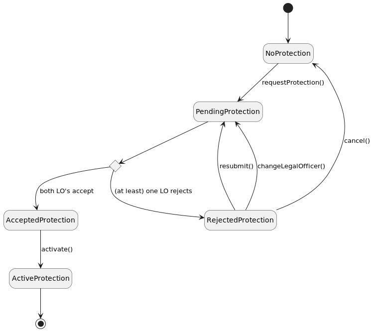
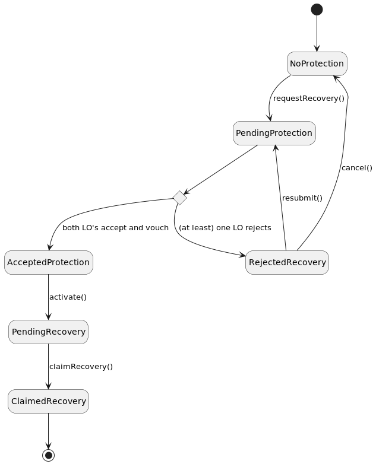

# Protection and Recovery

The global state of protection or recovery can be obtained and later on refreshed with:

```typescript
const protectionState = await authenticatedClient.protectionState();
const refreshedState = await protectionState.refresh();
```

:::caution
All user operations (`requestProtection`, `activate`, `cancel`, etc.), as well as `refresh`, do return a new state.
Always use the most recent state, and discard the former state.
In the example above, the var `protectionState` must not be used any more as soon as `refreshedState` is available.
:::

## Protection

The setup of a Polkadot account protection is a 3-steps process:
* **Choose 2 officers** among the official list of Logion Legal Officers.
* **Request** the protection towards those 2 LO's.
* Upon acceptance, **activate** the protection on the chain.

### Overview of the whole process



### Choose legal officers

The following call accesses the configured [logion-directory](https://github.com/logion-network/logion-directory)
to retrieve the list of available Legal Officers. A protection requires the user to choose 2 distinct Legal Officers
(in this sample Alice and Bob are selected).

```typescript
const legalOfficers: LegalOfficer[] = authenticatedClient.getLegalOfficers();

const alice = legalOfficers[0];
const bob = legalOfficers[1];
```

### Request a protection

You can submit your protection requests to the selected officers: 

```typescript
const noProtection = await authenticatedClient.protectionState() as NoProtection;
const pending = await noProtection.requestProtection({
    legalOfficer1: alice,
    legalOfficer2: bob,
    userIdentity: {
        email: "john.doe@invalid.domain",
        firstName: "John",
        lastName: "Doe",
        phoneNumber: "+1234",
    },
    postalAddress: {
        city: "",
        country: "",
        line1: "",
        line2: "",
        postalCode: "",
    }
});
```

### Activate the protection

You must first wait for both Legal Officers acceptance, and then activate the protection:

```typescript
const accepted = (await pending.refresh()) as AcceptedProtection;

accepted.activate(signer);
```

In case of refusal of one or both Legal Officers, the refreshed state will be `RejectedProtection`.

### Rejection Management

If rejected by one or more Legal Officer, you may either
* Resubmit the request to the officer who rejected,
* Or replace him/her with a new Legal Officer,
* Or completely cancel your protection request.

```typescript title="Resubmit to LO who rejected"
let rejectedProtection = (await authenticatedClient.protectionState()) as RejectedProtection;
const rejecter = rejectedProtection.protectionParameters.states.find(state => state.status === "REJECTED")!.legalOfficer;
rejectedProtection.resubmit(rejecter);
```

```typescript title="Replace LO who rejected with Charlie"
let rejectedProtection = (await authenticatedClient.protectionState()) as RejectedProtection;
const rejecter = rejectedProtection.protectionParameters.states.find(state => state.status === "REJECTED")!.legalOfficer;
const charlie: LegalOfficer = ...;
rejectedProtection.changeLegalOfficer(rejecter, charlie);
```

```typescript title="Cancel the protection request"
let rejectedProtection = (await authenticatedClient.protectionState()) as RejectedProtection;
rejectedProtection.cancel();
```

## Vault
Operations require an activated protection (see above [Protection Request](#protection))

### Transfer from vault

```typescript
let activeProtection = (await authenticatedClient.protectionState()) as ActiveProtection;

let vaultState = await activeProtection.vaultState();
const vaultAddress = vaultState.vaultAddress;
vaultState = await vaultState.createVaultTransferRequest({
    legalOfficer: alice,
    amount: new PrefixedNumber("1", NONE),
    destination: REQUESTER_ADDRESS,
    signer
});
const pendingRequest = vaultState.pendingVaultTransferRequests[0];
```

### Transfer to vault

A transfer to the vault is similar to any other [transfer](balance-transactions#transfer).
Simply use `vaultState.vaultAddress` as destination.

### Check vault balance

You must fist wait for one Legal Officer acceptance, and then see the effect of the transfer on the vault balance:

```typescript
vaultState = await vaultState.refresh();

const balance = vaultState.balances[0];
console.log("Balance :%s", `${balance.balance.coefficient.toInteger()}.${balance.balance.coefficient.toFixedPrecisionDecimals(2)}${balance.balance.prefix.symbol}`)
```

## Recovery

In order to recover a previously protected account, you must first create a new Polkadot account. Then follow these 3-stpes process:
* **Request a recovery** to the Legal Officers who protected the lost account.
* Upon acceptance and vouching of the recovery, **activate** the protection (of the new account) on the chain.
* **Claim** the recovery.

One claimed, you can recover the lost assets.

### Overview of the whole process



### Request a recovery

Recovery must be requested to the **same Legal Officers** who accepted to protect the lost account (in this case, Alice and Bob).

```typescript
const NEW_ADDRESS = "5GsxAu1XexDATCbDJbWxKSow4gdC6epkajZr7Ht8Ci9VZabV";

const authenticatedClient = await LogionClient.create({
    rpcEndpoints: [ 'wss://rpc01.logion.network' ], // A list of websocket endpoints
    directoryEndpoint: 'https://directory.logion.network' // A logion directory
}).authenticate([ NEW_ADDRESS ], signer);

const noProtection = await authenticatedClient.protectionState() as NoProtection;
const pending = await noProtection.requestRecovery({
    recoveredAddress: REQUESTER_ADDRESS,
    signer,
    legalOfficer1: alice,
    legalOfficer2: bob,
    userIdentity: {
        email: "john.doe@invalid.domain",
        firstName: "John",
        lastName: "Doe",
        phoneNumber: "+1234",
    },
    postalAddress: {
        city: "",
        country: "",
        line1: "",
        line2: "",
        postalCode: "",
    }
});

```

### Activate the new protection

You must first wait for LO's acceptance and vouching, and then activate the new protection:

```typescript
const accepted = (await pending.refresh()) as AcceptedProtection;

let pendingRecovery = await accepted.activate(signer) as PendingRecovery;
```

### Claim the recovery

Finally, the recovery is claimed:

```typescript
pendingRecovery = await pendingRecovery.waitForFullyReady();
const claimed = await pendingRecovery.claimRecovery(signer);
```

### Recover the lost balance

```typescript
const recoveredBalance = await claimed.recoveredBalanceState();
await recoveredBalance.transfer({
    signer,
    destination: NEW_ADDRESS,
    amount: recoveredBalance.balances[0].available,
});
```

:::info
The destination may be any address, not necessarily the new account address.
:::

### Recover the lost vault

As for any transfer from a vault, you must wait for one LO's approval.

```typescript
const newVault = await claimed.vaultState();
let recoveredVault = await claimed.recoveredVaultState();
recoveredVault = await recoveredVault.createVaultTransferRequest({
    legalOfficer: alice,
    amount: recoveredVault.balances[0].available,
    destination: newVault.vaultAddress,
    signer,
});

// ... Wait for LO's acceptance ...
newVault = await newVault.refresh();

// Check Vault balance
const newBalance = newVault.balances[0];
console.log("Balance :%s", `${newBalance.balance.coefficient.toInteger()}.${newBalance.balance.coefficient.toFixedPrecisionDecimals(2)}${newBalance.balance.prefix.symbol}`);
```

:::info
The destination may be any address, not necessarily the new vault address.
:::

### Rejection Management

If rejected by one or more Legal Officer, you may either
* Resubmit the request to the officer who rejected,
* Or completely cancel your recovery request.

```typescript title="Resubmit to LO who rejected"
let rejectedRecovery = (await authenticatedClient.protectionState()) as RejectedRecovery;
const rejecter = rejectedRecovery.protectionParameters.states.find(state => state.status === "REJECTED")!.legalOfficer;
rejectedRecovery.resubmit(rejecter);
```

```typescript title="Cancel the recovery request"
let rejectedRecovery = (await authenticatedClient.protectionState()) as RejectedRecovery;
rejectedRecovery.cancel();
```
